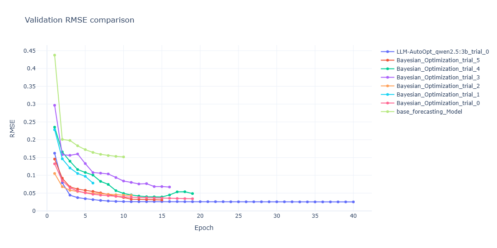

# My Project

<!-- Technology & Tools Badges -->


[](https://colab.research.google.com/github/USERNAME/REPO/blob/main/NOTEBOOK.ipynb)


---

## Description
# hyperopt-llm-project
LLM-AutoOpt is a hybrid HPO framework that combines BO with LLM-based contextual reasoning. The framework encodes dataset meta-features, model descriptions, historical optimization outcomes, and target objectives as structured meta-knowledge within LLM prompts, using BO to initialize the search and mitigate cold-start effects. This design enables context-aware and stable hyperparameter refinement while exposing the reasoning behind optimization decisions. Experiments on a multivariate time series forecasting benchmark demonstrate that LLM-AutoOpt achieves improved predictive performance and more interpretable optimization behavior compared to BO and LLM baselines without meta-knowledge.


## Features

Time-series preprocessing & cleaning

Meta-feature extraction (trend, seasonality, statistics, ACF, etc.)

Multiple forecasting models:
   Bi LSTM
HPO strategies:
   Bayesian Optimisation (BO)
   

Modular pipeline design
Easy experiment tracking
LLM-AutoOpt  using langchain
## ⚙️ Installation

### 1. Clone the repository
``` bash
git clone https://github.com/your-username/hyperopt-llm-project.git
cd hyperopt-llm-project
```

### 2.Install dependencies
``` bash
  pip install -e .
```
 ## 📊 Results
### Historical RMSE 
 

### Performance comparison of different hyperparameter optimization strategies on the forecasting task.

| Method                     | Mean RMSE ↓ | RMSE Std | Training Time (s) | Optimization Time (s) |
|----------------------------|-------------|-----------|-------------------|------------------------|
| Bi-LSTM-Base               | 5.42        | 0.31      | 31                | –                      |
| Bi-LSTM-BO (Top 3)         | 1.19        | 0.03      | 30                | 82                     |
| LLM-AutoOpt-NoMeta (Top 3) | 1.90        | 0.05      | 549               | 1065                   |
| **LLM-AutoOpt (Top 3)**    | **1.11**    | **0.04**  | 46                | 177                    |

## 📄 Paper

If you use this code or find it helpful, please refer to our paper:

**A Meta-Knowledge–Augmented LLM Framework for Hyperparameter Optimization in Time-Series Forecasting**

👉 https://arxiv.org/pdf/2602.01445


 
